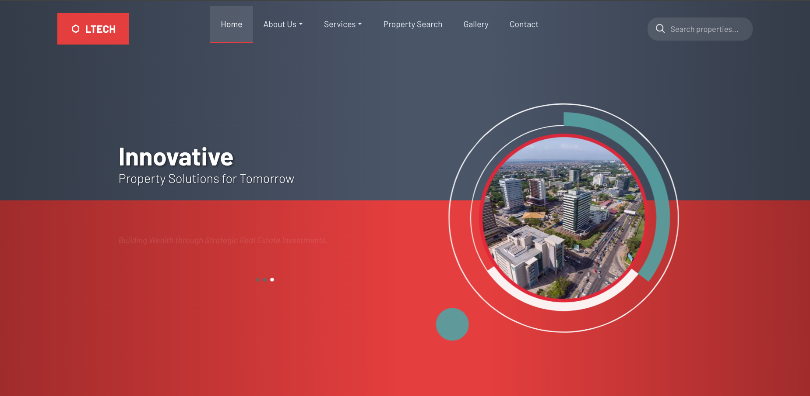

# 🏡 Ltech Homes – Real Estate Website

Ltech Homes is a modern and responsive real estate website built using **HTML**, **CSS**, and **JavaScript**. Designed to showcase properties with elegance and simplicity, it provides a clean interface for users to explore homes, apartments, and lands for sale or rent.

This frontend project is ideal for presenting property listings, highlighting services, and connecting with potential clients in the real estate industry.

🌐 Live Demo: [ltechhomes.vercel.app](https://ltechhomes.onrender.com/) 

---

## 📸 Preview

---

## 🔑 Key Features

- 📸 **Property Gallery** – Beautiful layouts for showcasing properties with images and short descriptions.
- 💼 **Why Choose Us Section** – Highlights the company’s strengths and unique value propositions.
- 🧑‍💼 **Our Team** – Introduces the professionals behind the brand.
- 📦 **Our Services** – Clearly outlines real estate offerings such as land sales, building rentals, and apartment listings.
- 🤝 **Partners Section** – Displays trusted business partners and collaborators.
- 📝 **FAQ Section** – Provides quick answers to common customer questions.
- 📣 **Testimonials** – Shares feedback from happy clients to build trust.
- 📁 **Portfolio Section** – Features completed and ongoing real estate projects.
- 📌 **Career Page** – Lists current job openings for those interested in joining Ltech Homes.

---

## 🛠️ Tech Stack

- **HTML5**
- **CSS3**
- **Bootstrap**
- **Vanilla JavaScript**
- [Swiper.js](https://swiperjs.com/) (optional for sliders)
- [Render](https://render.com/) for deployment

---

## 🚀 Getting Started

